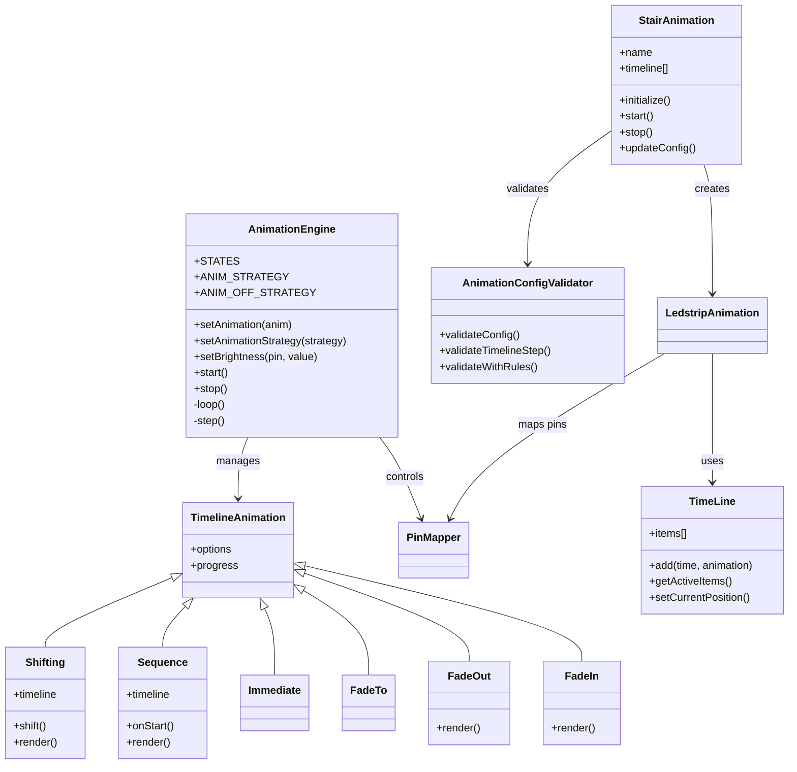
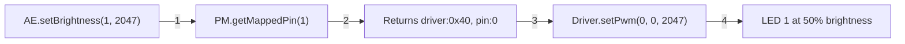
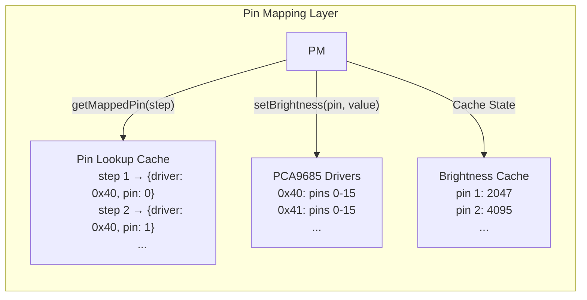

# StairLED Server

A Node.js-based LED stair lighting control system with advanced animation capabilities, sensor integration, and web-based management interface.

## Overview

StairLED Server provides a complete solution for controlling LED strips on staircases with features including:

- Real-time LED animation engine with multiple animation strategies
- Motion sensor integration for automated lighting control  
- Web interface for animation design and configuration
- MQTT support for distributed sensor networks
- WebSocket-based live preview and monitoring
- Multi-driver support with focus on PCA9685 PWM controllers
- Timeline-based animation sequencing
- Configurable easing functions and transitions

## System Architecture

The system consists of several key components:

### Core Components

- **StairledApp**: Main application orchestrator
- **AnimationEngine**: Core animation processing and rendering
- **WebServer**: Express-based HTTP interface
- **WebsocketServer**: Real-time communication
- **PinMapper**: Hardware abstraction layer
- **Sensor**: Motion/presence detection
- **MqttClient**: Distributed messaging

### Animation System

```mermaid
flowchart TB
    subgraph "Main Timeline"
        direction TB
        MainTimeline[LedstripAnimation Timeline]
        MainTimeline --> |t=0| Fade1[FadeIn]
        MainTimeline --> |t=500| Seq1[Sequence Animation]
        MainTimeline --> |t=1000| Shift1[Shifting Animation]
        
        subgraph "Sequence Internal Timeline"
            direction TB
            Seq1 --> SeqTimeline[Sequence Timeline]
            SeqTimeline --> |t=0| FadeTo1[FadeTo LED 1]
            SeqTimeline --> |t=100| FadeTo2[FadeTo LED 2]
            SeqTimeline --> |t=200| FadeTo3[FadeTo LED 3]
        end
    end

    subgraph "Rendering Process"
        direction TB
        Time[Current Time&#58; 600ms] --> GetActive[Get Active Animations]
        GetActive --> |Main Timeline| RenderSeq[Render Sequence]
        RenderSeq --> |Internal Timeline| RenderFadeTo[Render Active FadeTo]
        RenderFadeTo --> CalcBrightness[Calculate LED Brightness]
        CalcBrightness --> UpdatePins[Update PinMapper]
    end

    subgraph "LED States"
        direction LR
        LED1[LED 1&#58; Done] --> |4095| PWM1[PWM]
        LED2[LED 2&#58; Active] --> |2048| PWM2[PWM]
        LED3[LED 3&#58; Pending] --> |0| PWM3[PWM]
    end
```

```mermaid
flowchart LR
    subgraph "Configuration"
        Config[FadeIn Config] --> |Validate| Options["`
            options = {
              duration: 1000,
              leds: [1, 2, 3],
              start: 0,
              end: 4095
            }
        `"]
    end

    subgraph "Animation Setup"
        direction LR
        Options --> TimeAnim[Create TimelineAnimation]
        TimeAnim --> |t=0| AddToTimeline[Add to LedstripAnimation]
        AddToTimeline --> Ready[Animation Ready]
    end

    subgraph "Rendering Process"
        direction LR
        Time[Current Time&#58; 600ms] --> GetActive[Get Active Animations]
        GetActive --> |Main Timeline| RenderSeq[Render Sequence]
        RenderSeq --> |Internal Timeline| RenderFadeTo[Render Active FadeTo]
        RenderFadeTo --> CalcBrightness[Calculate LED Brightness]
        CalcBrightness --> UpdatePins[Update PinMapper]
    end

    subgraph "LED States"
        direction LR
        LED1[LED 1&#58; Done] --> |4095| PWM1[PWM]
        LED2[LED 2&#58; Active] --> |2048| PWM2[PWM]
        LED3[LED 3&#58; Pending] --> |0| PWM3[PWM]
    end
```








## Animation Types

### Base Animations
- **FadeIn**: Fades LEDs from 0 to target brightness
- **FadeOut**: Fades LEDs from current to 0 brightness
- **FadeTo**: Fades LEDs to specific brightness
- **Immediate**: Sets LEDs to brightness instantly

### Complex Animations
- **Sequence**: Executes animations in sequence with internal timeline
- **Shifting**: Shifts LED patterns with optional bounce
- **StairAnimation**: High-level stair pattern orchestration

### Timeline System
The animation system uses a hierarchical timeline approach:
1. Main timeline manages overall animation sequence
2. Nested timelines handle complex animations (e.g., Sequence)
3. Each animation calculates LED states based on progress
4. PinMapper translates states to hardware signals

## Hardware Integration

### Supported Hardware
- PCA9685 PWM controllers (12-bit resolution, 0-4095)
- Auto-discovery of multiple PCA9685 devices on I2C bus (0x40-0x7F)
- Hardware PWM frequency configuration (default: 52kHz)
- Automatic I2C bus scanning and validation
- Graceful error handling and recovery
- Resource cleanup on shutdown

### Pin Mapping System
```javascript
// Example pin mapping configuration
{
  "pinMapping": [
    // Maps stair step 1 to first PWM pin on driver at 0x40
    {"step": 1, "driver": "0x40", "pin": 0},
    // Maps stair step 2 to second PWM pin
    {"step": 2, "driver": "0x40", "pin": 1}
  ]
}
```

Key features:
- Automatic pin mapping generation if none exists
- Multiple driver support via I2C addressing
- Real-time pin state monitoring
- Pin testing and validation utilities
- Dynamic remapping capabilities
- Brightness state caching

### Hardware Management
- Automatic device discovery on I2C bus
- Driver validation through MODE1 register checks
- Multi-device coordination
- Pin state persistence
- Robust error recovery
- Resource cleanup handlers

## Configuration

### System Configuration
```javascript
{
  "server": {
    "port": 3000,
    "host": "0.0.0.0"
  },
  "mqtt": {
    "enabled": false,
    "broker": "mqtt://localhost",
    "username": "",
    "password": ""
  },
  "sensors": [
    {
      "name": "bottom",
      "pin": 17,
      "type": "PIR"
    }
  ],
  "pinmapper": {
    "mapping": [
      {"step": 1, "driver": "0x40", "pin": 0},
      {"step": 2, "driver": "0x40", "pin": 1}
    ]
  }
}
```

### Web Interface
The system provides web interfaces for:
- Pin mapping configuration (/pca9685)
- Real-time PWM control
- Animation design and testing
- Hardware status monitoring
- Sensor configuration

## Development

### Animation Development
To create a new animation type:
1. Extend TimelineAnimation class
2. Implement render() method
3. Define validation rules
4. Register in AnimationConfigValidator

Example:
```javascript
class CustomAnimation extends TimelineAnimation {
    static getValidationRules() {
        return {
            required: ['duration', 'leds'],
            types: {
                duration: 'number',
                leds: 'array'
            }
        };
    }

    render() {
        const output = {};
        // Calculate LED states based on this.progress
        return output;
    }
}
```

### Code Patterns
- Validation-first approach for configurations
- Event-driven sensor integration
- Promise-based async operations
- Class-based animation hierarchy
- Timeline-based state management


### Pin Mapper

The PinMapper internally maps your actual stair steps to the physical pins on your pca9685 hardware, and allows you to plug the led strip for any random step into any random free port and define what step number it actually is.




